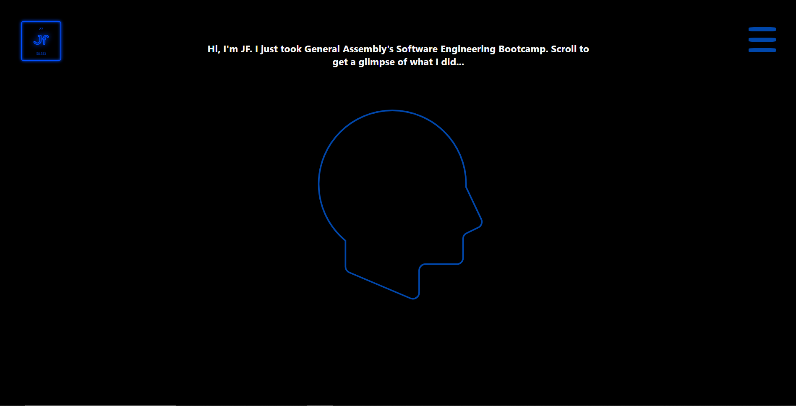

# JF's SEB71 Journey
A website detailing the things I did and learnt in General Assembly's Software Engineering Bootcamp (SEB71).

Here's the [link](https://cobaltdingus.github.io/jf-journey/) to my project.

### Technologies Used
* Languages: HTML, CSS, Javascript
* Libraries: ScrollMagic, barba.js, GSAP, highlight.js